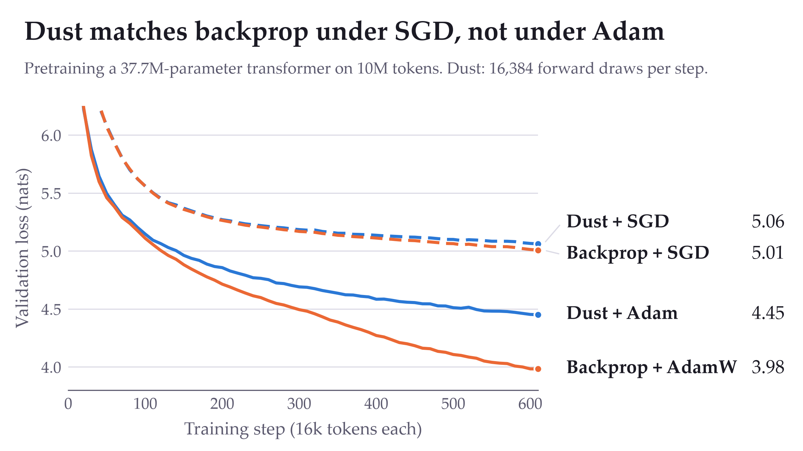

# Reproducing Dust, with an AdamW baseline

An independent reproduction of [Dust: Pretraining Transformers Without Backpropagation](https://qlabs.sh/research/dust),
built on the official release at commit `2fdb01b`. It is not affiliated with the paper's authors.

**Report:** [interactive web page](https://huskydoge.github.io/dust/) (English and 中文) ·
[English PDF](report/dust-reproduction-en.pdf) · [中文 PDF](report/dust-reproduction-zh.pdf) · [result tables](RESULTS.md)



## What we found

1. **The release reproduces the paper.** Every Dust cell with a published number, with SGD from the release and under
   Adam as rebuilt here, lands within 0.05 of the published test loss. Backprop with SGD matches to three decimals.
2. **The paper's main baseline is backprop with SGD at a constant learning rate.** With AdamW, backprop is about 1 nat
   better at 10M tokens, and no Dust run with SGD comes near it.
3. **Dust under Adam does not keep up at 10M tokens.** At 1M tokens (61 steps) it is within 0.02 of backprop with AdamW
   at a population of 16,384. At 10M tokens it tracks backprop for about a hundred steps and then falls steadily behind,
   ending 0.5 nat above it. Changing the learning rate or β1 recovers at most 0.02.
4. **Dust still improves a backprop-trained checkpoint, but less than backprop does.** Continued from an AdamW
   checkpoint it lowers the loss only at a learning rate below the one tuned for training from scratch, and reaches 73%
   to 85% of backprop's improvement over the same 200 steps at a population of 16,384.
5. **The cost is large.** At 10M tokens the 16,384-population run took 8 GPUs for about 7 hours; backprop with
   AdamW took one GPU for about 90 seconds, most of it evaluation.

## Scope

One model size (37.7M parameters), training from scratch on up to 10M tokens, populations up to 16,384, and one seed per
Dust run except where [RESULTS.md](RESULTS.md) lists more. **We did not test whether a larger population closes the gap
to AdamW.** At 10M tokens, going from 4,096 to 16,384 narrows it from 0.62 to 0.50 nat at four times the compute. The
paper's Adam experiment at 1M tokens goes to a population of 65,536.

Dust under Adam is not part of the official release. `dust_adam.py` rebuilds it from the paper's Appendices E and F. The
appendix gives the number of draws per layer family under Adam but not their split across blocks, so the split here
rescales the SGD one; that is our assumption. It matches the four published points at 1M tokens.

## What this fork adds

| File | Purpose |
|---|---|
| `baselines/backprop_adam.py` | Backprop with AdamW at the paper's Adam settings, plus options to save and continue a checkpoint |
| `dust_adam.py` | Dust under Adam; `DUST_ADAM_LR` and `DUST_ADAM_BETA1` override the matrix learning rate and β1 |
| `dust_cpt.py` | Continue a backprop checkpoint with Dust under Adam |
| `prepare_cpt_data.py` | Continuation data and a 100M-token training set that no existing split contains |
| `reproduction/results/` | `config.json`, `metrics.jsonl` and `result.json` of every run |
| `reproduction/summarize.py` | Prints the tables in [RESULTS.md](RESULTS.md) from those records |
| `docs/index.html` | The report page served at [huskydoge.github.io/dust](https://huskydoge.github.io/dust/) |

The official `dust.py`, `model.py` and `baselines/backprop.py` are unchanged.

## Running it

Set up the environment and data as in the [top-level README](../README.md), then:

```bash
# AdamW baseline
python baselines/backprop_adam.py --tokens 10M --output runs/bp-adamw-10m

# Dust under Adam (1, 1, 4 and 8 GPUs for populations 256, 1024, 4096 and 16384)
python dust_adam.py --tokens 10M --population 1024 --output runs/dust-adam-10m-p1024
torchrun --standalone --nproc_per_node=8 dust_adam.py --tokens 10M --population 16384 --output runs/dust-adam-10m-p16384

# Continue a backprop checkpoint for 200 steps on unseen tokens
python prepare_cpt_data.py
python baselines/backprop_adam.py --tokens 10M --save-final --output runs/bp-adamw-10m-ckpt
python baselines/backprop_adam.py --train-file data/train_cpt.pt --steps 200 --eval-interval 10 \
    --init runs/bp-adamw-10m-ckpt/final.pt --lr 0.0005 --output runs/cpt-bp
DUST_ADAM_LR=0.0005 DUST_INIT=runs/bp-adamw-10m-ckpt/final.pt DUST_DATA=cpt DUST_STEPS=200 \
    python dust_cpt.py --tokens cpt --population 1024 --output runs/cpt-dust
```

The report was drafted with Claude Opus 5.5 from the run records; any errors are ours.
